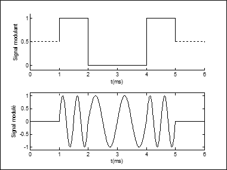
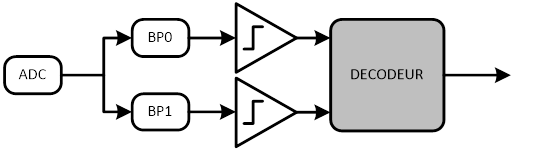

# Étude de la communication audio

Le but de la communication audio est de transmettre des ordres au robot.  Ces ordres seront codés sous forme d'une trame de bits.  Cette suite de bits devra ensuite être transformée en un signal audio par la modulation par déplacement de fréquence (FSK : *Frequency Shift Keying*, en anglais).  
Le robot recevra ce signal audio grâce à un microphone.  Ce signal devra être mis en forme par une chaîne d'acquisition, puis converti par l'ADC du dsPIC Communication.  Le signal numérisé devra alors être démodulé et interprété par le dsPIC.

## Format de la trame de commande

Une trame de communication est généralement composée de 3 parties :

* Un préambule, qui permet de repérer le début la trame. Il peut également contenir des informations sur la trame, par exemple la quantité de données qu'elle contient.
* Les données à transmettre, qui sont la partie utile de la trame.
* Un postambule, qui permet de repérer la fin de la trame (pour vérifier qu'elle est correctement formatée).  Il peut également contenir un code détecteur et/ou correcteur d'erreurs.

Ici, nous nous sommes inspirés de la trame utilisée par les UART pour définir la nôtre.

### Préambule

Pour indiquer le début d'une trame, nous émettrons un *Start Bit* à l'état '0'.

### Données

Nos données sont composées de deux parties : l'ordre et le paramètre correspondant.

Il y a 4 ordres différents, nous avons donc besoin de 2 bits pour le coder :

| Ordre | Code | Paramètre |
| --- | --- | --- |
| Avance | 0b00 | distance à parcourir, non signé, en cm. |
| Recule | 0b01 | distance à parcourir, non signé, en cm. |
|Tourne à droite | 0b10 | angle à parcourir, non signé, en degrés |
| Tourne à gauche | 0b11 | angle à parcourir, non signé, en degrés|

Le paramètre sera codé sur 8 bits :

* Cela facilitera sa transmission entre les 2 dsPIC
* Cela permet des translations de 2,55 m et des rotations de 256°, ce qui est suffisant dans le cadre du projet

### Postambule

Pour détecter une erreur dans la trame reçue, le 1er bit du postambule est un bit de parité : sa valeur est définie pour que le nombre total de bits '1' dans la trame soit pair.  
Le postambule se termine par un *Stop bit* toujours à l'état '1'.

### Format de la trame complète

| Préambule | Données |  | Postambule | |
| --- | --- | --- | --- | --- |
| Start bit | Ordre | Paramètre | Parité | Stop bit |
| '0' | 2 bits | 8 bits | 1 bit | '1' |

## Dimensionnement de la chaine d'acquisition audio

### Amplification

Le capteur est un microphone de type piézoélectrique, avec un étage de sortie à transistor intégré, qu'il faut polariser par une résistance de 2,2 kΩ.  Il fournit un signal de 1 mv alternatif d'amplitude au maximum (pour un niveau sonore normal).  
Le signal du capteur doit être amplifié avant d'entrer dans l'ADC.  Ce dernier accepte des tensions entre 0 V et 3,3 V.  
Pour que la chaine d'acquisition respecte cette contrainte,  l'ampli-op de son dernier étage devra être alimenté entre 0 V et 3,3 V.

### Filtre de garde

Puisque nous allons numériser notre signal audio, il faut placer un filtre de garde dans la chaine d'acquisition pour éviter le repliement spectral.

Notre filtre de garde devra respecter les paramètres suivants :

* Atténuation maximale des fréquences utiles : H1 = 0,99
* Atténuation minimale des fréquences repliées : H2 = 0,05
* Filtre d'ordre 2, pour limiter le nombre d'étage de la chaine analogique
* Filtre de Butterworth, car il a la réponse la plus "plate" possible dans la bande passante.

Pour rappel, l'amplitude de la réponse en fréquence d'un filtre de Butterworth est :
$$
||H(j\omega)|| = \sqrt{\frac{1}{1+(\frac{\omega}{\omega_c})^{2n}}}
$$
où n est l'ordre du filtre et c sa pulsation de coupure.

## Modulation du signal

Le principe de la modulation FSK est semblable à celui de la modulation de fréquence analogique : pour construire le signal modulé (qui est le signal audio qui sera émis), on part d'une fréquence porteuse (Fp) que l'on modifie en fonction du signal modulant (qui est l'information que l'on veut transmettre).

Le cas d'une modulation FSK binaire est illustré sur la figure ci-dessous :

On émet un signal entre 1 ms et 5 ms.  Lorsqu'il n'y a pas de signal à émettre, le signal modulé est nul.
Le signal modulant représente une suite de bits, c'est donc une onde carrée dont la période ($T_s$) est choisie en fonction de la modulation.  
Pour construire le signal modulé à partir du signal modulant, nous devons encore choisir deux paramètres de notre modulation, la fréquence porteuse ($f_p$) et le déplacement de fréquence ($\Delta f$).

Dans notre exemple, nous avons choisi :
$$
T_s = 1 ms \\
f_p = 1500 Hz \\
\Delta f = 500 Hz
$$

La modulation de fréquence est alors définie par :
$$
\text{signal modulé} = A_0 sin(2\pi(f_p-\delta f)t) \Leftrightarrow \text{signal modulant} = 0 \\
A_0 sin(2\pi(f_p+\Delta f)t) \Leftrightarrow \text{signal modulant} = 1
$$

Les valeurs utilisées pour l'exemple ci-dessus ont été choisie pour rendre la figure lisible.  
Dans le cadre du projet nous utiliserons les paramètres suivants :
$$
T_s = 100 ms \\
f_p = 1000 Hz \\
\Delta f = 100 Hz
$$

## Démodulation du signal

### Schéma de principe

Pour démoduler le signal numérisé par l'ADC, nous allons utiliser deux filtres passe-bande (**BP0** et **BP1**), chacun centré sur une des fréquences possibles :
$$
f_0=f_s-\Delta f \\
f_1=f_s+\Delta f
$$

Si le signal audio contient la fréquence en question, la sortie du filtre aura une amplitude élevée.  En comparant cette amplitude à un seuil (à définir), on transforme le signal filtré en un signal binaire qui indique la présence (ou non) de f0/f1 dans le signal audio numérisé.

En combinant ces deux signaux logiques, on peut distinguer 4 états possibles du signal audio :

* Silence : absence de f0 et f1
* Bit 0 : présence de f0 et absence de f1
* Bit 1 : absence de f0 et présence de f1
* Bruit : présence de f0 et f1

C'est le rôle du décodeur, qui observe l'état du signal audio au cours du temps.  Lorsqu'il détecte un Bit 0 (pendant une durée Ts) :

* Il note l'état du signal pendant les 10 périodes suivantes (puisque notre message comprend 10 bits)
* Il vérifie que le bit suivant assure bien la parité du message
* Il vérifie enfin que la trame est terminée par un Stop Bit.

Si c'est le cas, le message a bien été reçu.  Par contre si le signal audio présente un bit de silence ou de bruit pendant la trame, le message est considéré comme erroné et est ignoré.  Il en est de même si la parité n'est pas correcte ou si le Stop Bit manque.

La fonction implémentant le décodeur vous est fournie.

### Filtres passe-bande

Le démodulateur utilise deux filtres passe-bande, centrés chacun sur une des fréquences du signal modulé.
Ils devront respecter les paramètres de dimensionnement suivants :

* Les fréquences utiles se situent dans une bande de +/-1,5% autour de la fréquence centrale
* Les fréquences situées au-delà de +/-3,5% de la fréquence centrale doivent être coupées
* Atténuation maximale des fréquences utiles : H1 = 0,9
* Atténuation minimale des fréquences coupées : H2 = 0,1
