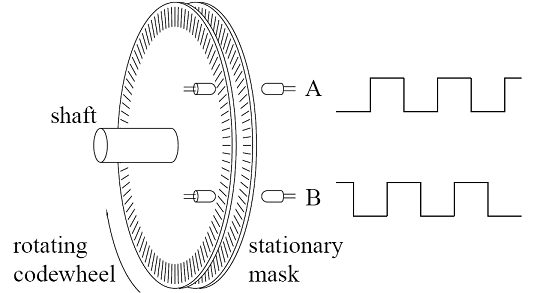
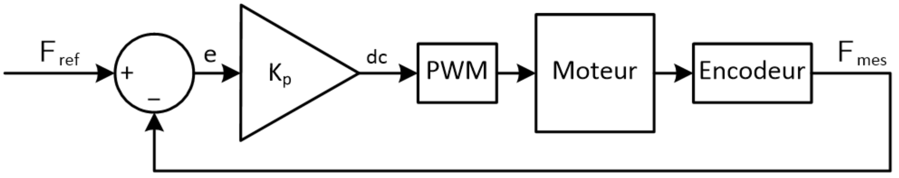
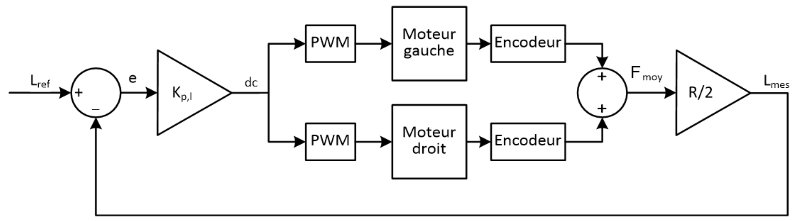
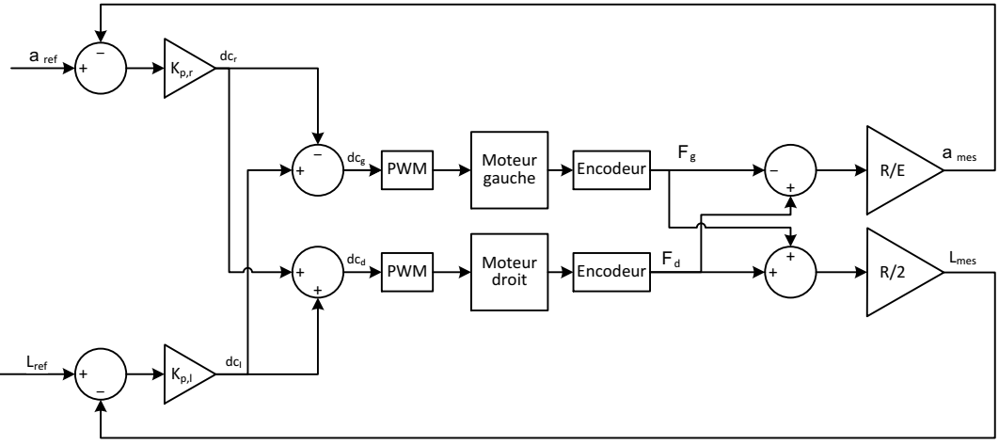
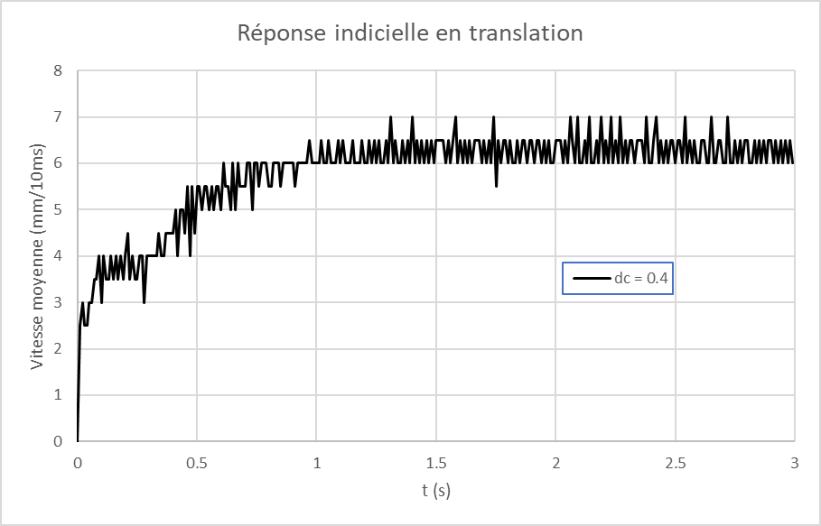
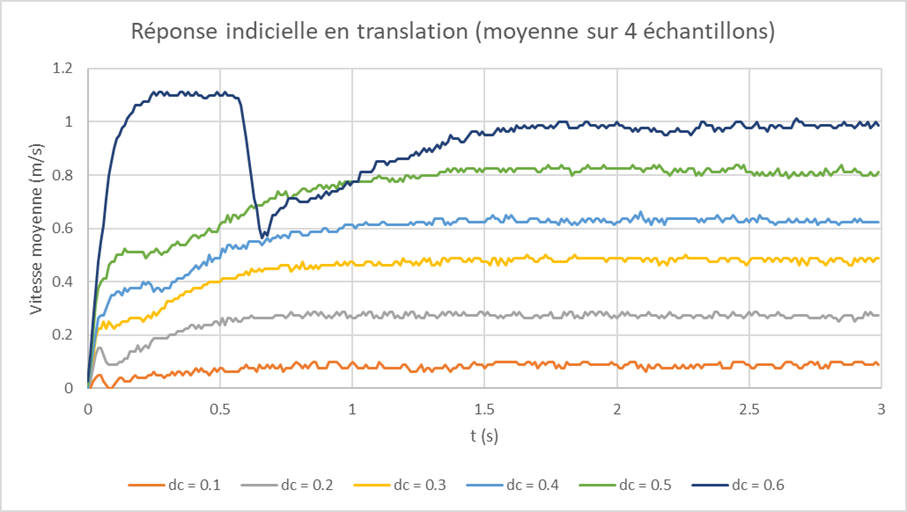
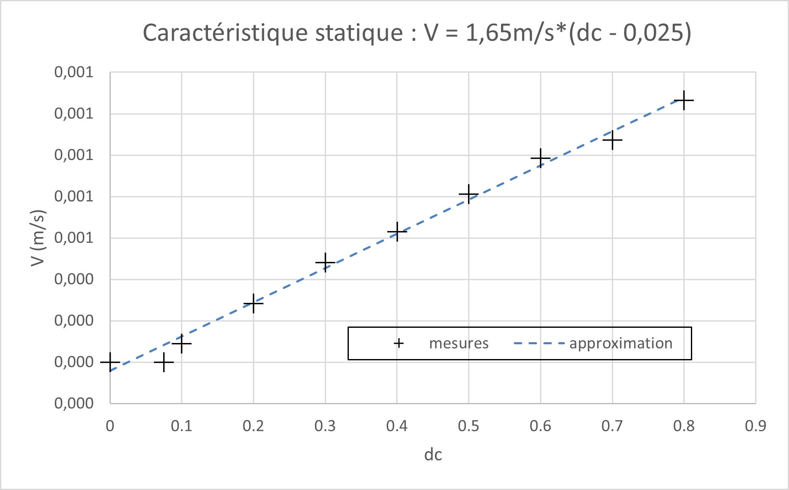
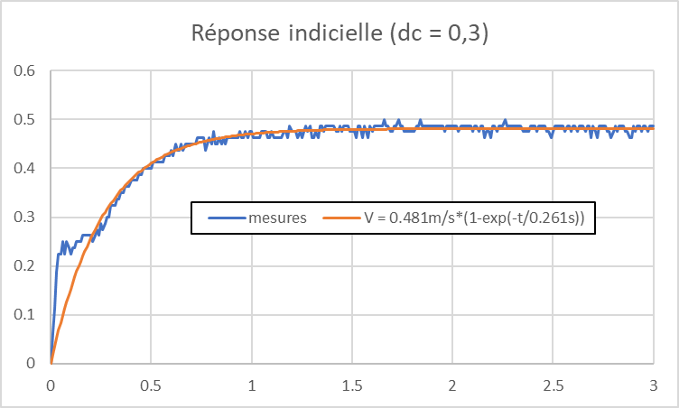
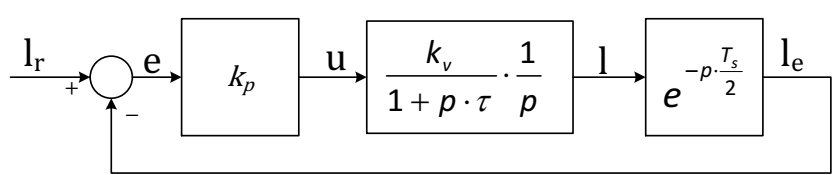

# Étude du déplacement du robot

Le but de ce document est de rassembler les informations nécessaires au développement du code informatique de la partie Déplacement du projet intégré.

La première partie de ce document contient les informations techniques concernant les périphériques d'interface entre le microcontrôleur et le robot.

La seconde partie décrit le développement du régulateur de position à implémenter.

## Informations techniques

### Le dsPIC Déplacement

Le dsPIC *Déplacement* est un *dsPIC33FJ128MC802*.  C'est un processeur spécialisé dans le contrôle de moteur.  Il possède 2 périphériques d'interface pour encodeur en quadrature et un périphérique *Output Compare* capable de générer 4 PWM, soit tout ce dont nous avons besoin pour contrôler simultanément 2 moteurs.

Remarque : le *dsPIC33FJ128MC802* possède également un périphérique appelé *motor control PWM module*, qui permet de générer des formes de PWM complexes.  N'ayant besoin que d'une "simple" PWM par moteur, nous utiliserons le *Output Compare*, plus simple à utiliser.

### Interface avec les moteurs

Le robot est équipé de moteurs DC commandés en tension par l'intermédiaire de ponts en H.   Nous utiliserons le module *DRI0044* qui contient 2 ponts en H pour contrôler nos moteurs.

### Principe de l'encodeur en quadrature

Les capteurs de rotation peuvent prendre de nombreuses formes, mais une des plus utilisées est l’encodeur incrémental en quadrature.  Ce dispositif est composé d’une roue perforée solidaire de l’axe dont on veut mesurer la rotation, et de 2 capteurs (souvent optique) permettant de détecter le passage d’une fente de la roue.  La position des capteurs permet de détecter le sens de rotation.

Le passage de la roue devant les 2 capteurs optiques génère deux trains d’ondes carrées, nommés A et B.  
Les 2 capteurs sont positionnés de telle façon que ces ondes carrées soient décalées de 90° (raison pour laquelle on appelle ce capteur encodeur en **quadrature**).  
Selon que le flanc montant de A arrive avant ou après le flanc montant de B, on sait dans quel sens se déplace la roue.  Chaque flanc montant ou descendant correspond donc à la rotation d’une fraction de tour connue, dans le sens positif ou négatif.

Les encodeurs de nos moteurs ont 360 fentes sur leur roue codeuse.  En comptant tous les flancs, on peut obtenir la position angulaire de la roue avec une précision de 0,25°.

### Interface avec les encodeurs en quadrature

Le *dsPIC33FJ128MC802* possède 2 périphériques conçus pour interpréter les signaux d'un encodeur en quadrature : les *Quadrature Encoder Interface* (QEI).
Le rôle du QEI est de détecter les flancs des deux signaux d'un encodeur en quadrature et d’incrémenter (ou de décrémenter selon le sens de rotation) un compteur.  

La valeur de ce compteur donne le déplacement angulaire de la roue.

## Description du régulateur utilisé

Nous allons utiliser la régulation polaire, classiquement utilisée pour le positionnement des robots.  Elle permet de contrôler séparément les mouvements de translation et de rotation.

Avant de décrire le fonctionnement de ce régulateur, étudions le cas de la régulation d'un seul moteur.

### Régulateur de position pour un moteur

* Au centre, nous avons le bloc *Moteur* qui représente la fonction de transfert du moteur et du système mécanique qu'il actionne.
* Il est suivi du bloc *Encodeur* qui fournit la mesure de la position : $\phi_mes$.  Ici, il s'agit de la position angulaire du moteur.
* L'erreur de position *e* est calculée en soustrayant $\phi_mes$ à la position désirée $\phi_ref$
* Le régulateur utilisé est un simple proportionnel de gain *Kp*, qui fournit le signal de commande à appliquer au moteur : *dc*.  Classiquement, on exprime la commande à appliquer au moteur par le *rapport cyclique* (ou *Duty Cycle*).  Il représente la fraction de la tension d'alimentation (ici la batterie 7,2V) à appliquer au moteur.  Il peut donc varier entre -1 et 1.
* Enfin, le bloc *PWM* transforme le rapport cyclique en un signal de commande adapté au moteur utilisé.  Il représente à la fois l'*Output Compare* du *dsPIC* et le *DRI0044.

Nous allons modifier ce régulateur pour contrôler les mouvements de translation ou de rotation de notre robot.  Nous allons dans un premier temps étudier les deux cas séparément.

### Régulateur de translation

Dans le cas d'une translation, les deux roues doivent parcourir la même distance, en même temps.

Nous appliquons donc le même signal de commande (*dc*) aux deux moteurs.

Pour la mesure de position, nous utilisons la somme des mesures des deux encodeurs $\phi_mes$.

La grandeur que nous voulons contrôler est la distance parcourue par le robot, nous multiplions donc la position mesurée par le rayon des roues (R).  Nous le divisons aussi par 2 pour obtenir la moyenne des distances parcourues par chaque roue.

Ce régulateur contrôle la distance parcourue par le robot, mais si les deux moteurs n'ont pas exactement la même fonction de transfert, la trajectoire du robot sera un arc de cercle et non une droite.

### Régulateur de rotation

Dans le cas d'une rotation, les deux roues doivent parcourir la même distance, mais dans des sens opposés.  
Le point situé au milieu des deux roues est le centre de la rotation.  

On choisit le sens trigonométrique comme sens positif.  La roue droite tourne alors vers l'avant et la roue gauche vers l'arrière.  On doit donc inverser le signe de la commande appliquée au moteur gauche.

On veut contrôler la position angulaire du robot $\alpha$.  Un petit calcul géométrique nous donne
$$
\alpha=\frac{R}{E} \cdot (\theta_d-\theta_g )
$$

* $\alpha$ est la position angulaire du robot
* *R* est le rayon des roues
* *E* est l'empattement du robot (la distance entre les deux roues).
* $theta_{d,g}$ sont les positions angulaires des roues

Ce régulateur contrôle l'angle parcouru par le robot, mais si les deux moteurs n'ont pas exactement la même fonction de transfert, le milieu des roues se déplacera.

### Combinaison des deux régulateurs

Le régulateur polaire est la combinaison du régulateur de translation et de celui de rotation.

Pour effectuer une translation, il suffit de changer la consigne de distance $L_{ref}$ en gardant la consigne d'angle $\alpha_{ref}$ constante.

Le régulateur de translation agit comme précédemment, en agissant sur la distance moyenne parcourue par les deux roues.

Le régulateur de rotation agit pour compenser une éventuelle différence entre les deux moteurs en gardant les distances parcourues par les deux roues égales.

On peut faire le même raisonnement pour une rotation en inversant les rôles des régulateurs.

## Dimensionnement du régulateur de translation

Pour dimensionner les régulateurs, nous devons obtenir un modèle du robot. Cette section décrit en détail le dimensionnement du régulateur de translation.  La même méthode peut être appliquée pour le régulateur de rotation.

### Modélisation du robot

Comme nous n'avons pas d'informations sur le fonctionnement interne des moteurs, nous allons utiliser une approche empirique pour créer un modèle de notre robot.

Chaque roue du robot est équipée d'un encodeur en quadrature possédant qui nous permet de mesurer la position angulaire des roues avec une précision de 0,25°.  Les roues font 82mm de diamètre.

### Mesures

Nous savons qu'il existe une relation entre la tension appliquée au moteur (définie par le rapport cyclique) et sa vitesse.  Pour obtenir cette relation, nous allons relever la réponse de la vitesse du robot à un échelon de tension de 0 à la valeur désirée.  Cet échelon est appliqué aux deux moteurs simultanément, pour obtenir un mouvement de translation du robot.

Nous allons travailler avec une fréquence d’échantillonnage de 100Hz, qui est une valeur courante pour le contrôle des moteurs en robotique.  La vitesse de chaque roue est mesurée en comptant le nombre d’impulsions durant une période d’échantillonnage.  Pour obtenir la vitesse de translation, on fait simplement la moyenne des vitesses des deux roues.

La Figure ci-dessus donne un exemple de la réponse indicielle obtenue en utilisant les mesures brutes.  
On voit qu'elle est bruitée par la quantification des encodeurs.
Pour rendre ces courbes plus lisibles, on va appliquer un filtrage passe-bas très simple : le filtre à moyenne glissante.  Chaque échantillon de la sortie du filtre est la moyenne des *n* échantillons précédents.

En effectuant les mesures pour plusieurs rapports cycliques et en appliquant un filtre à moyenne glissante, on obtient :

On observe un transitoire qui peut être approché par un système du 1er ordre, suivi d'une phase de régime où la vitesse est constante.  

On peut observer une "bosse" au début des courbes.  Elle est due au patinage des roues au démarrage du robot.

Le démarrage devient d'ailleurs chaotique pour les rapports cycliques supérieurs à 0,5.
Pour obtenir la courbe "dc = 0,6", nous avons été obligés de le démarrer sans que les roues ne touchent le sol et de le poser à terre lorsque les roues ont démarré, ce qui explique l'allure de la courbe.

### Caractéristique statique

Pour obtenir la caractéristique statique de la vitesse du robot en translation, nous avons déduit des courbes précédentes la vitesse nominale pour chaque rapport cyclique, en faisant la moyenne sur la dernière seconde de chaque courbe.

En théorie, cette caractéristique est linéaire, ce qui est confirmé par nos mesures.

Par contre, il faut appliquer un rapport cyclique d'au moins 0,1 pour que le robot commence à bouger.  Cette "imperfection" est due aux frottements dans la chaine de transmission mécanique entre les moteurs et les roues.

Nous obtenons la caractéristique statique du robot en calculant la droite de régression basée sur nos mesures.

La pente de cette droite est le gain statique vitesse/dc du robot en translation.

On peut voir que cette droite est une bonne approximation des mesures, sauf pour les rapports cycliques inférieurs à 0,1.  Dans notre dimensionnement, nous allons négliger cette imperfection et considérer que notre caractéristique statique est une droite de pente $k_v=1,65m/s$, passant par l'origine.

### Modèle dynamique

Pour modéliser le comportement dynamique du robot, nous allons utiliser une réponse indicielle et l'interpoler par une réponse indicielle d'un système du 1er ordre :

Nous avons choisi la réponse pour dc = 0,3 parce que le patinage au démarrage est limité et son amplitude est suffisante pour avoir une bonne interpolation.
Nous obtenons une constante de temps : $\tau=261ms$ ; le gain correspond évidemment à la vitesse nominale pour ce rapport cyclique.

### Modèle complet

Nous allons donc modéliser le comportement de notre robot en translation par un système linéaire du 1er ordre :
$$
H_v(p) = \frac{V(p)}{U(p)} =\frac{k_v}{1 + p \cdot \tau}
$$
Comme nous voulons une régulation en position, il nous suffit alors d'ajouter un intégrateur pour obtenir notre fonction de transfert en position :
$$
H_v(p) = \frac{V(p)}{U(p)} =\frac{k_v}{(1 + p \cdot \tau) \cdot p}
$$

### Schéma de régulation

Notre système possède un pôle intégrateur, nous pouvons donc nous contenter d'un simple régulateur proportionnel :

Le bloc le plus à droite représente l'échantillonnage des encodeurs.  C'est un délai d'une demi-période d'échantillonnage.

Nous obtenons la fonction de transfert en boucle ouverte de notre système :
$$
BO(p)=\frac{L_e(p)}{E(p)} = \frac{k_p \cdot k_v \cdot e^{-p \cdot \frac{T_s}{2}}}{(1 + p \cdot \tau) \cdot p}
$$

### Dimensionnement du régulateur

Nous allons utiliser les critères des marges de gain et de phase pour dimensionner notre régulateur.

Nous avons donc besoin des expressions du gain et de la phase de la réponse harmonique du système en boucle ouverte :
$$
||BO(j\omega)|| = \frac{k_p \cdot k_v}{\omega \cdot \sqrt{1 + (\omega \cdot \tau)^2 }}
$$
$$
\phi(BO(j\omega)) = -\omega \cdot \frac{T_s}{2} - arctg(\omega \cdot \tau) - \pi/2
$$
Nous voulons une marge de gain d'au moins 6dB et une marge de phase d'au moins 30°.  Ce sont des valeurs de bonnes pratiques couramment utilisées.

#### Marge de gain

La marge de gain est définie comme l'inverse du module de la réponse harmonique en boucle ouverte à la pulsation pour laquelle sa phase vaut -180°.  Cette marge de gain doit être supérieure à 1 pour que le système soit stable.

Soit $\omega_1$ la pulsation recherchée :
$$
\phi(BO(j\omega_1)) = -\pi \Leftrightarrow arctg(\omega_1 \cdot \tau) + \omega_1 \cdot \frac{T_s}{2} = \frac{\pi}{2}
$$
En résolvant cette relation numériquement, on trouve $\omega_1=27,8rad/s$

Le critère de la marge de gain peut s'écrire :
$$
||BO(j\omega_1)|| =-6dB = \frac{1}{2} = \frac{k_{p1} \cdot k_v}{\omega_1 \cdot \sqrt{1 + (\omega_1 \cdot \tau)^2 }}
$$
$$
\Rightarrow k_{p1} = \frac{\omega_1 \cdot \sqrt{1 + (\omega_1 \cdot \tau)^2 }}{2 \cdot k_v} =61,6m^{-1}
$$

#### Marge de phase

La marge de phase est définie comme la différence entre la phase de la réponse harmonique en boucle ouverte à la pulsation pour laquelle son module vaut 1 et −180°.

Cette marge de phase doit être positive pour que le système soit stable.  Pour avoir une marge de phase de 30°, nous devons donc trouver la pulsation pour laquelle la phase vaut -150°.

Soit $\omega_2$ la pulsation recherchée, la marge de phase peut s'écrire :
$$
M_{\phi} = \pi/6 = \phi\Big(BO(j\omega_2 )\Big)-(-\pi)  = -\omega_2  \frac{T_s}{2} - arctg(\omega_2 \cdot \tau) - \frac{\pi}{2} + \pi
$$
$$
\Leftrightarrow arctg(\omega_2 \cdot \tau) \mp \frac{T_s}{2} = \frac{\pi}{3}
$$
En résolvant cette relation numériquement, on trouve $ω_2=6,31rad/s$.

Le critère de la marge de phase peut s'écrire :
$$
||BO(j\omega_2)|| = 1 = \frac{k_{p2} \cdot k_v}{\omega_2 \cdot \sqrt{1 + (\omega_2 \cdot \tau)^2 }}
$$
$$
\Rightarrow k_{p2} = \frac{\omega_2 \cdot \sqrt{1 + (\omega_2 \cdot \tau)^2 }}{k_v} = 3,69m^{-1}
$$

#### Conclusion

Nous choisirons évidemment le $k_p$ le plus petit de ceux obtenus par les différents critères de dimensionnement :
$$
k_p=3,69m^{-1}
$$

## Génération de consigne

Pour que le déplacement du robot ne soit pas trop brutal et que les régulateurs puissent fonctionner correctement, il faut que les consignes qui leur sont fournies correspondent à une trajectoire physiquement réalisable.
Nous avons choisi une trajectoire pour laquelle l'évolution de la vitesse au cours du temps est un trapèze ; elle est donc divisée en 3 parties :

* Une phase d'accélération, où la vitesse, nulle au départ, croît linéairement jusqu'à atteindre la vitesse nominale
* Une phase à vitesse constante
* Une phase de décélération, semblable à la phase d'accélération.

En intégrant ce profil de vitesse de translation/angulaire, nous obtenons une trajectoire de distance/orientation, qui sera la consigne du régulateur correspondant.

La vitesse maximale de notre robot est 1,65m/s (en extrapolant la caractéristique statique).  Pour que le régulateur fonctionne correctement, il faut choisir un point de fonctionnement pas trop proche des limites du système.

Nous choisissons 0,5m/s comme vitesse nominale du robot, également pour éviter des mouvements trop rapides lors des tests.

On peut estimer l'accélération maximale du robot en se basant sur la pente à l'origine de la réponse indicielle pour un rapport cyclique de 1 :
$$
a_{max} = \frac{k_v}{τ} = 6,3 m⁄s^2
$$

Après avoir essayé plusieurs accélérations, nous décidons de limiter l'accélération de notre consigne à 0,5 m⁄s^2  pour que les mouvements de notre robot ne soient pas trop brusques.
