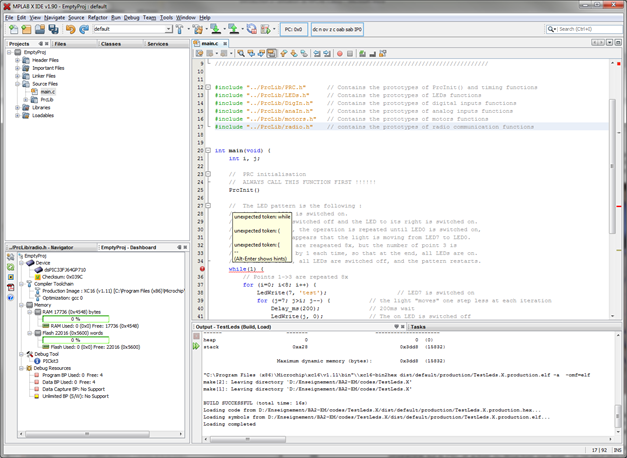
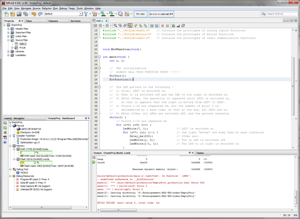
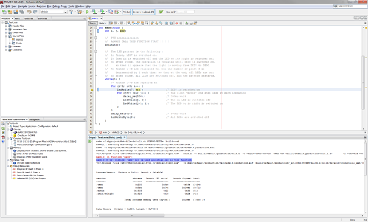
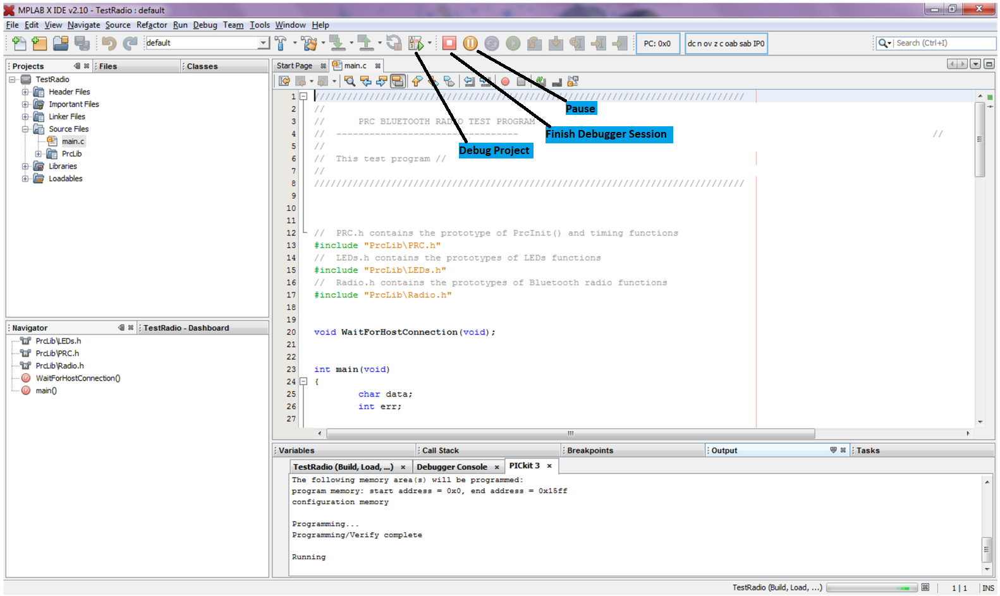
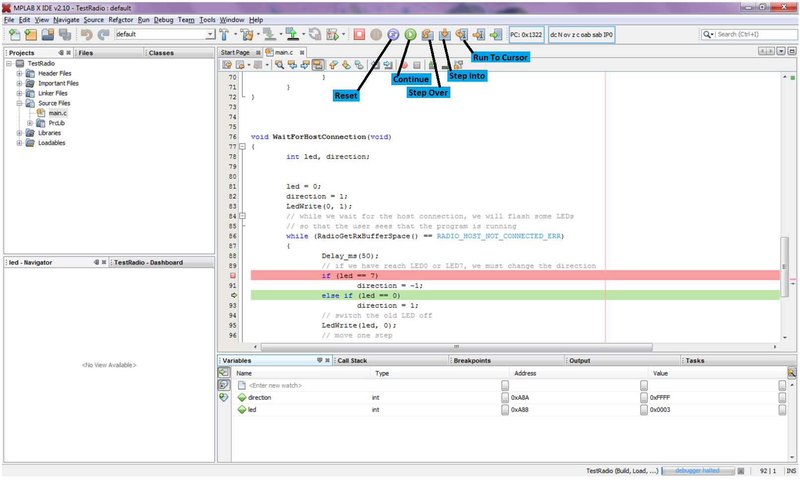

# Correction des erreurs

## Erreurs lors de l'écriture du code

*MPLAB X* analyse constamment votre code et vous indique vos erreurs sans que vous ayez besoin de compiler votre projet.

Dans l'exemple ci-dessous, il indique qu'il ne s'attend pas à trouver le mot réservé *while* à cet endroit.  Cette erreur est en fait due à l'absence d'un ';' à la fin de la ligne 25.

Grace à cette correction permanente, vous corrigerez toutes les erreurs de syntaxe avant d'essayer de compiler votre code.

Il arrive souvent, comme dans cet exemple que le message n'apparaisse pas sur la ligne de l'erreur, mais un peu plus loin dans le code.

## Erreurs lors de la compilation

Toutefois, *MPLAB X* ne peut pas détecter toutes les erreurs sans tenter de compiler votre code.

Dans l'exemple suivant, La fonction *ErrFunction()* est déclarée au début de *main.c* et appelée dans la fonction *main()*.  
Cependant, elle n'est définie nulle part.  
*MPLAB X* ne détecte pas ce type d'erreur avant la compilation, car il suppose que la fonction est définie dans un autre fichier source du projet.

De plus, il arrive qu'il détecte quelque chose de suspect, mais qui n'est pas nécessairement une erreur.  
Dans ce cas, il vous laisse le bénéfice du doute et compile votre code sans provoquer d'erreur.  
Néanmoins, il vous indique ce qu'il a détecté sous forme d'un *Warning* dans la fenêtre de sortie.

Dans l'exemple suivant, il a remarqué que la variable *err* n'est pas initialisée avant d'être utilisée comme argument de la fonction *LedWrite*, ce qui provoquera un comportement indéterminé.  
Toutefois, il ne considère pas cela comme une erreur et compile le code, au cas où nous aurions omis d'initialiser *err* intentionnellement.

## Erreurs d'exécution

Il arrive (malheureusement assez souvent) que votre programme compile, mais ne fasse pas ce que vous attendiez lors de l'exécution.

Pour comprendre ce qu'il se passe, vous pouvez uitlisez le mode *Debugger* de *MPLAB X*.

On passe dans ce mode en cliquant sur le bouton *Debug Project*.  
le programme est alors compilé, envoyé au dsPIC et exécuté par le processeur.

Une nouvelle barre d'outils apparait :

A la différence du mode programmateur, il est possible d'interrompre l’exécution du programme à tout moment avec le bouton *Pause*.
Les autres boutons de la barre deviennent alors actifs et la prochaine ligne à exécuter est surlignée en vert :

Lorsque le programme est en pause, il est possible de visualiser l’état des variables dans l'onglet *Variables* de la fenêtre de sortie.  
Les valeurs affichées ne sont mises à jour qu'au début de chaque pause.

Il est également possible de faire avancer le programme ligne par ligne avec les boutons *Step Over* et *Step Into*.

* En utilisant *Step Into* sur une ligne qui appelle une fonction, le *debugger* va entrer dans la fonction et exécuter une seule de ses instructions à chaque *Step Into*
* En utilisant *Step Over* le programme exécute toute la fonction appelée (même si elle fait 1000 lignes)

Le bouton *Reset* permet de revenir au début du programme, pour pouvoir recommencer son exécution depuis le début.

## Debugger le programme avec les breakpoints

Repérer des erreurs de programmation n’est pas chose facile avec un µC car les commandes du type *print* n’existent pas. C’est pourquoi l’on utilise très souvent les *breakpoints*.

Le principe est le suivant : lorsque le programme exécute une ligne où se trouve un *breakpoint*, le µC se met automatiquement en pause. Il est dès lors possible de visualiser l’état de toutes les variables et ainsi de vérifier le bon fonctionnement du programme.  
C’est également une manière simple de s’assurer que le programme exécute bien certaines lignes.

Pour ajouter un *breakpoint/ sur une ligne, il suffit de double cliquer dessus.  
La ligne est surlignée en rouge et 1 carré rouge apparait dans la marge (voir ligne 90 ci-dessus).

Remarque : Normalement, le programme s'arrête avant d'exécuter la ligne où se situe le *breakpoint*. Toutefois, il arrive qu'il s'arrête sur la ligne d'après, comme ci-dessus.
