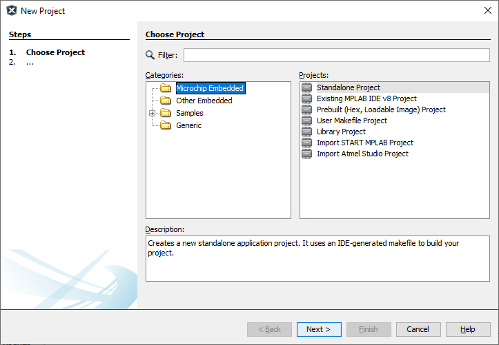
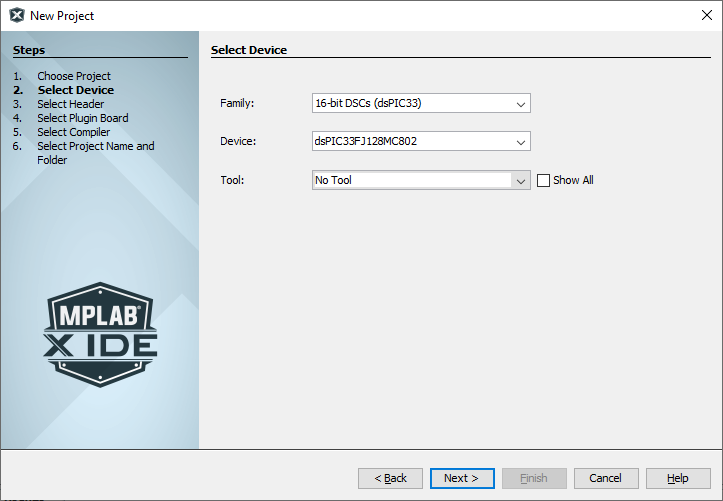
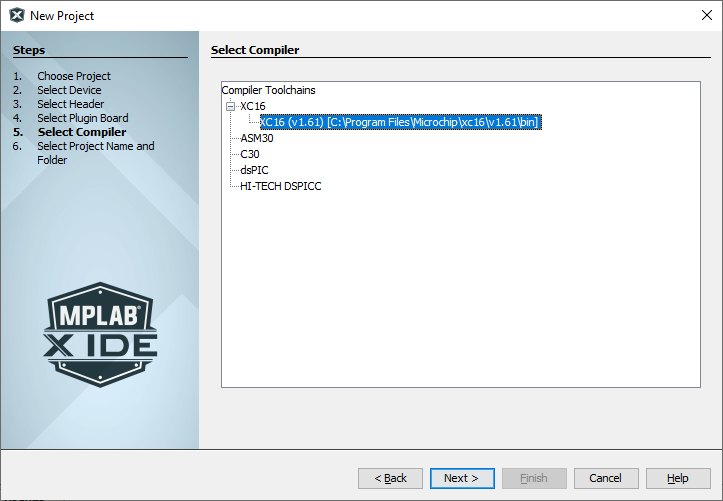
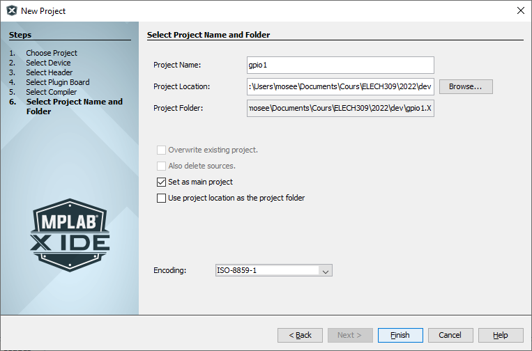
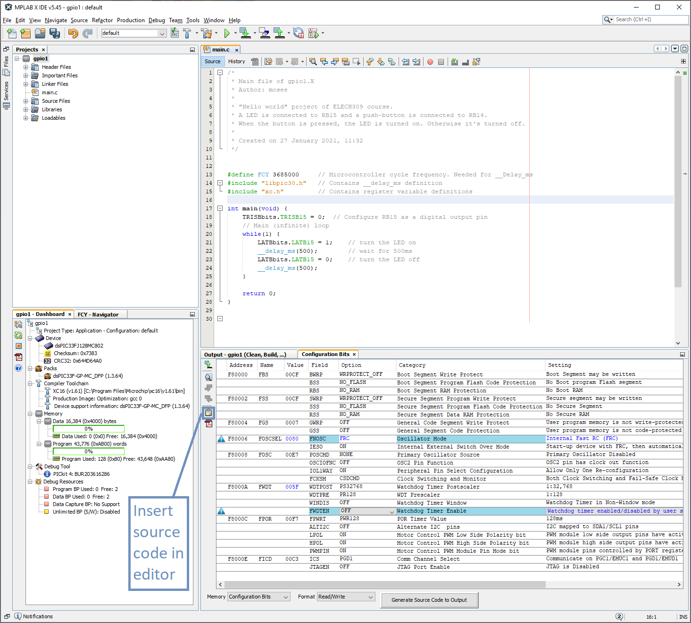

# Création d'un projet dans *MPLAB X*

Lors de la création d'un projet, vous devez préciser une série de paramètres, dans plusieurs fenêtres de dialogue.

## Le type de projet

Nous allons créer des nouveaux projets pour des microcontrôleurs de *Microchip* :

* Dans le menu *File*, sélectionnez *New Project…*
* Sélectionnez *Microchip Embedded* et *Standalone Project*

## Le microcontrôleur et le programmateur

Un paramètre important du projet est évidemment le microcontrôleur sur lequel le programme sera exécuté.  Il définit les caractéristiques hardware de la cible : taille des mémoires, périphériques…

* Dans *Family*, sélectionnez *16-bit DSCs (dsPIC33)*
* Dans *Device*, sélectionnez *dsPIC33FJ128MC802*

Le 3ème paramètre définit l'outil qui fera le lien entre votre PC et le microcontrôleur.  Il permet de transférer votre programme dans sa mémoire.  Il permet également de le débugger.

* Cochez *Show All*
* Dans *Tool*, sélectionnez *Pickit 4*

Il y a aussi une famille *Recently used*, qui permet un accès rapide à vos microcontrôleurs favoris.

## Le compilateur

Le compilateur traduit votre code source (en C) en langage machine. Il dépend évidemment du type de microcontrôleur choisi.  *XC16* est le compilateur fourni par *Microchip*.  Il existe des firmes spécialisées dans le développement de compilateurs qui proposent des alternatives, généralement payantes.

* Sélectionnez *XC16*

## Derniers détails

Enfin, vous devez donner un nom à votre projet et décider où vous voulez le sauver.
Lors de son installation, *MPLAB X* a créé un dossier *MPLABXProjects* dans votre dossier utilisateur, qui est l'emplacement proposé par défaut.
*MPLAB X* sauve ses projets dans un dossier portant son nom avec une extension *".X"*.

Vous pouvez modifier cet emplacement, en respectant quelques restrictions : l'emplacement et le nom de votre projet ne peuvent contenir ni espace ni caractères accentués (é, à, ç…).
Par exemple : *c:\Users\mosee\enseignement\ELECH309\2021\MPLABX\gpio1.X* est valide.

## Ajout d'un fichier

Le projet ne contient aucun fichier source.  Pour en ajouter un :

* Dans le menu *File*, sélectionnez *New File …*
* Dans l'étape *Choose File Type*
  * Dans *Categories*, choisissez *icrochip Embedded/XC16 Compiler*
  * Dans *File Types*, vous êtes obligé de choisir *mainXC16.c*
* Dans l'étape *Name and Location*, donnez un nom à votre fichier.  En C, le fichier source principal d'un projet est généralement nommé *main.c*

Le fichier ainsi créé contient déjà un squelette de code.

## Configuration bits

Il reste une dernière étape pour avoir un projet fonctionnel : définir les *Configuration bits*.

Ces bits servent à indiquer au *dsPIC* comment il doit fonctionner.  Par exemple, il a besoin d'une horloge (comme tous les processeurs).  Toutefois, il possède plusieurs oscillateurs internes et peut aussi utiliser une horloge externe.  Il faut donc un moyen de lui indiquer quelle horloge il doit utiliser.

La valeur de ces *Configuration bits* peut être définie dans le code source. Ils seront écrit dans le *dsPIC*, en même temps que le code du projet.

* Dans le menu *Production*, sélectionnez *Set Configuration Bits*

Dans la fenêtre de sortie un onglet *Configuration Bits* est apparu.  Il donne leur valeur par défaut.  Nous devons en changer quelques-unes pour correspondre à notre application :

* Changez l'option de
  * *FNOSC* en *FRC*
  * *FWDTEN* en *OFF*

Votre projet devrait ressembler à ceci :

Placez votre curseur sur une ligne vide en dessous de votre code et cliquez sur le bouton *Insert source code in editor* pour ajouter la définition des *Configuration bits* dans le code.
