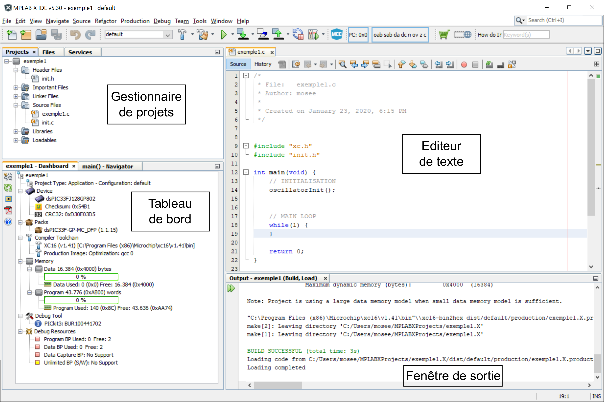
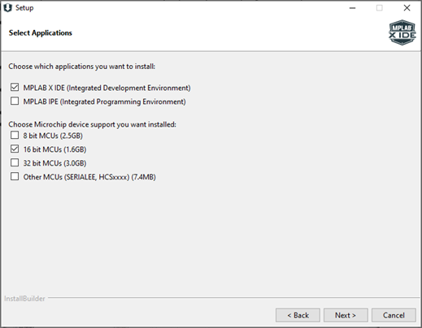

# MPLAB X

## Introduction

Tous les outils logiciels nécessaires à la programmation des microcontrôleurs de *Microchip* sont regroupés dans un *environnement de développement intégré* (*IDE* : Integrated Development Environment) appelé *MPLAB X*.
Un *IDE* a pour but d'être l'interface unique par laquelle le programmeur peut accéder à tous les outils dont il a besoin :

* un éditeur de texte, qui permet d'écrire le code source.  Il est spécialement adapté à cette tâche.  Par exemple, le texte est coloré pour le rendre plus lisible, l'indentation du texte est automatique, la syntaxe est corrigée en temps-réel...
* un gestionnaire de projet, qui permet de gérer et d'accéder aux fichiers composant le projet
* une fenêtre de sortie, dans laquelle les messages d'informations et d'erreurs des outils s'affichent
* un tableau de bord qui résume les informations de configuration du projet
* des barres d'outils et des menus permettant de lancer les autres outils : le compilateur, le debugger, le simulateur et le programmateur

## Installation de la suite d'outils

Pour programmer le dsPIC, vous aurez besoin d'installer deux programmes, disponibles sur le site de *Microchip*.

### *MPLAB X*

C'est l'environnement de développement intégré (IDE) de *Microchip* pour tous ces processeurs.

<https://www.microchip.com/mplab/mplab-x-ide>

Comme nous ne l'utiliserons que pour la famille des *dsPIC*, vous pouvez n'installer que leur support :

Les valeurs par défaut des autres boîtes de dialogue peuvent être gardées.

### Le compilateur *XC16*

<https://www.microchip.com/mplab/compilers>

En plus de l'IDE, nous devons aussi installer le compilateur pour les dsPIC.  Le compilateur traduit votre programme, écrit en C, en code binaire compréhensible par le dsPIC.
Ce code binaire est spécifique à chaque famille de microcontrôleurs.  *XC16* peut compiler du code pour tous les microcontrôleurs 16 bits de *Microchip*.
Vous pouvez utiliser les options d'installation par défaut.
