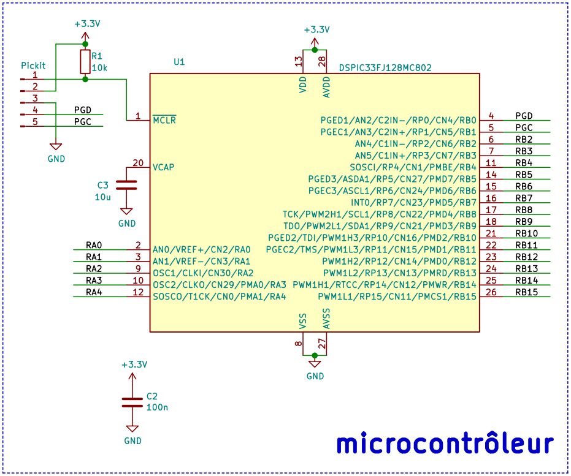
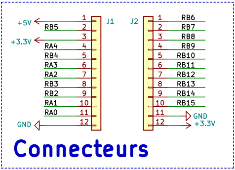
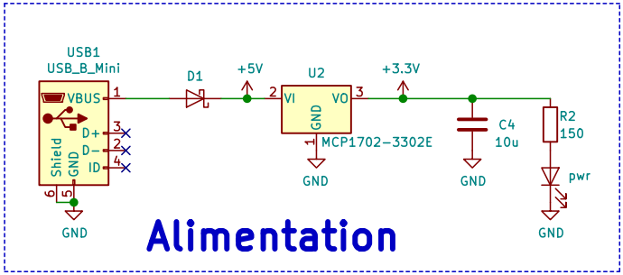

# Le module MC802

Le schéma électronique du module du [module MC802](Module%20MC802.pdf) peut être divisé en 3 parties.

## Le dsPIC

Sur le symbole du µC, on voit :

* les pattes d'*I/O*, organisées en 2 *ports* :
  * le **PORTA** (su le bas du côté droit)
  * le **PORTB** (sur le côté droit)
* Les autres pattes ne sont pas utilisables dans le code, ellesassurent le bon fonctionnement du dsPIC :
  * **VDD/VSS** : pattes d'alimentation du µC. Les dsPIC acceptent une tension d'alimentation entre 3V et 3,6V. Nous l'alimenterons en 3,3V (qui est sa tension nominale).
  * **AVDD/AVSS** : pattes d'alimentation de la partie analogique du µC.  Les µC ayant des ADC et/ou DAC ont en général une alimentation séparée pour leurs circuits analogiques, dans le but de limiter le bruit venant de l'alimentation.
  * **MCLR** : Master Clear (active à l'état bas) permet de maintenir le µC en reset, soit un état où il est inactif.  Lorsque **MCLR** est désactivé, le µC commence à exécuter son programme depuis le début.  Cette patte doit être maintenue à l'état haut lors du fonctionnement normal du µC, c'est le rôle de *R1*.
  * **VCAP/VDDCORE** : cette patte est la sortie du régulateur de tension interne du dsPIC.  En effet, le processeur du dsPIC (le "core") est alimenté en 2,5V.  Pour pouvoir fonctionner correctement, ce régulateur a besoin d'un condensateur de sortie de 10µF, qui ne peut être intégré dans le circuit.  Cette patte sert donc uniquement à connecter ce condensateur (*C3*).

*C2* est un condensateur de découplage.  Il sert à filtrer le bruit sur l'alimentation du µC.

Le connecteur **PICKit** permet de connecter un programmateur au dsPIC, qui permettra d'y téléverser les programmes.  
Ce programmateur utilise 3 pattes : **MCLR**, **PGD** (Program Data) et **PGC** (Program Clock).  Ces deux dernières peuvent également servir d'entrées/sorties au dsPIC.  De plus, il existe 3 paires de **PGD/PGC**, ce qui nous donne plus de liberté pour utiliser ces pattes.  
On fait ce choix en utilisant les *configuration bits*.

## Les connecteurs d'extension

Ce sont les 2 connecteurs permettant d'enficher le module sur un protoboard.  
Il regroupe toutes les pattes d'I/O disponibles (**RB0** et **RB1** sont utilisées pour connecter le programmateur).  
Il possède également des pattes de masse et d'alimentation 5V et 3,3V.

* les pattes **+3.3V** permettent d'alimenter d'autres circuits à partir du module.
* La patte **+5V** peut être utilisée dans les 2 sens : pour alimenter un circuit extérieur (comme **+3.3V**) ou pour alimenter le module à partir d'une source extérieure (voir ci-dessous).

## L'alimentation

Le module peut être alimenté :

* par son connecteur micro-USB.  Dans ce cas, le module peut alimenter des circuits extérieurs au travers de sa patte **+5V**
* par une source de tension continue extérieure connectée à sa patte **+5V**

**D1** sert à éviter la mise en parallèle des sources de tension au cas où le module est alimenté simultanément des 2 côtés (ce qui est une mauvaise idée).

Quelque soit la source utilisée, elle alimente un régulateur de tension linéaire (**U2**) qui fournit une tension continue de 3,3V à partie d'une tension d'entrée entre 4V et 13,2V.  
C'est lui qui alimente le µC et les éventuels circuits connectés aux pattes **+3.3V**.  
Il peut fournir au maximum 250mA.  
On peut voir qu'aucune protection n'est prévue pour le cas où une source extérieure serait connectée sur **+3.3V**. On ne peut donc pas alimenter le module par **+3.3V**.

**C4** est un condensateur de découplage nécessaire au bon fonctionnement du régulateur.

On a ajouté une LED pour indiquer quand le circuit est alimenté.
