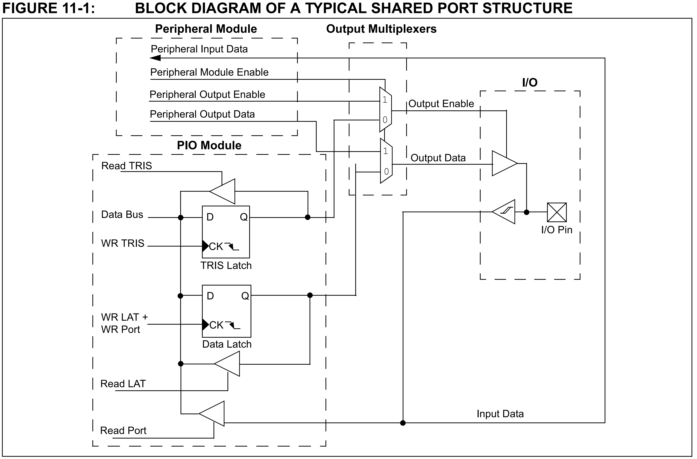

# Les PIO

Les pattes d'entrée/sortie d'un µC peuvent souvent jouer plusieurs rôles.  C'est pour cela qu'elles ont plusieurs noms sur le symbole du dsPIC.  Ces différents rôles sont liés aux périphériques internes du µC.

PIO est l'acronyme de *Parallel Input/Output* (*PIO*). C'est le rôle le plus simple que peut prendre une patte d'I/O d'un µC.  
Cette appellation vient du fait que les pattes sont groupées en *port*, pour être manipulées par le µC au travers de registres.

On trouve également la dénomination *General Purpose Input/Output* (*GPIO*), entre autres dans la notice du dsPIC.

La figure ci-dessous (venant de la notice du dsPIC) montre le schéma-bloc du circuit logique d'une patte d'I/O :



Examinons les différentes parties de ce schéma :

* Dans le bloc **I/O**, on trouve la patte proprement dite (I/O pin) : le petit carré contenant une croix.  Elle directement connectée à un buffer de sortie (*tri-state*) et un buffer d'entrée (à *trigger de Schmitt*).
* Le bloc **Output Multiplexers** définit qui contrôle le buffer de sortie : la patte peut servir de sortie à un périphérique du dsPIC ou être connectée au **PIO Module** (pour servir de *PIO*).  Par défaut, les multiplexeurs sont configurés pour le rôle *PIO*.
* Le **Peripheral Module** montre les connexions vers les périphériques qui peuvent être connectés à cette patte.  Il ne nous intéresse pas pour l'instant.
* Lorsque le **PIO Module** est connecté aux buffers de la patte, l'*Output Enable* du buffer de sortie est alors contrôlé par **Tris Latch** (*TRIS* est l'abréviation de *TRI-State*).  C'est donc l'état de ce bistable qui décide si la patte est une entrée (1) ou une sortie (0).
  * Dans le cas où **Tris Latch** vaut 0, l'état logique de la patte est défini par le **Data Latch**.
  * Dans le cas où **Tris Latch** vaut 1, l'état logique de la patte est défini par le "monde extérieur".
  * Ces bistables sont connectés au bus de données (Data Bus) du dsPIC

Les bistables **Tris Latch** et **Data Latch** de plusieurs pattes sont groupés pour former des registres du µC.  
Cela nous permet de contrôler plusieurs pattes en même temps, d'où le nom de *Parallel I/O*.  Les pattes contrôlées ensemble forment ce qu'on appelle un port.

Notre dsPIC possède 2 ports : **PORTA** et **PORTB**.  **PORTA** regroupe les pattes **RA0** à **RA4** et **PORTB** les pattes **RB0** à **RB15**.

Chaque port a 3 registres :

* TRIS, il est composé des **Tris Latch** et définit quelles pattes du port sont des sorties et lesquelles sont des entrées.  Le rôle de chaque patte peut être choisi individuellement.  Par défaut, toutes les pattes sont des entrées.
* **LAT**, il est composé des **Data Latch** et définit l'état de la patte dans le cas où elle est une sortie.  Dans le cas où elle est une entrée, son état n'a pas d'influence sur la patte.  Son état par défaut est indéterminé.
* **PORT**, dont l'utilisation est plus subtile :
  * Écrire dans **PORT** a le même effet qu'écrire dans **LAT**.
  * Lire dans **PORT** permet de récupérer l'état logique de la patte elle-même.

## Utiliser les PIO dans un programme

Notre code doit pouvoir modifier l'état des registres associés aux *PIO*.  Pour cela, une variable est associée à chaque registre du dsPIC (ces variables sont définies dans *xc.h*).  Ces variables (de type *uint16_t*) portent le même nom que le registre auquel elles sont associées.

Pour les *PIO*, nous en avons donc 3 : *TRISx*, *LATx* et *PORTx*.
Dans la notice du dsPIC, les '*x*' minuscules dans les noms de registres indiquent qu'ils en existent plusieurs.  Dans le cas des *PIO*, nous avons *TRISA*, *LATA*, *PORTA* et *TRISB*, *LATB*, *PORTB*.  
Les noms des variables associées aux registres sont toujours en majuscules.

De plus, il existe en général une autre variable de type structure qui permet d'accéder à chaque bit de son registre associé séparément.  
C'est pratique car, souvent, on veut pouvoir agir sur une seule patte.  
Le nom de ces structures est le nom du registre (en majuscule) suivi de '*bits*' (en minuscule).  
Le nom des champs de ces structures est le même que dans la notice du dsPIC.

*Microchip* recommande d'utiliser *LAT* pour imposer l'état des sorties et *PORT* pour lire l'état des entrées.

Par exemple, les lignes de code ci-dessous configure la patte *RB15* en sortie à l'état haut :

```c
TRISBbits.TRISB15 = 0;
LATBbits.LATB15 = 1;
```
