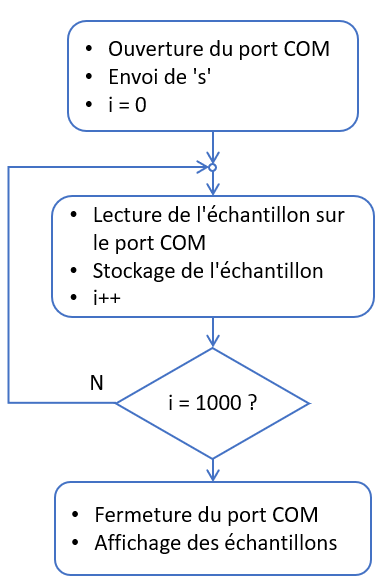

# Réalisation d'un oscilloscope

## Introduction

Nous allons tranformer notre voltmètre en un oscilloscope connecté à un PC qui s'occupera de l'affichage des mesures effectuées par le dsPIC.  
La communication entre le dsPIC et le PC se fera via un convertisseur USB-UART.

Ce document décrit la méthodologie suivie pour concevoir cet oscilloscope.  Il a donc aussi pour but de vous servir d'exemple du type de documentation attendue en fin de projet.

## Cahier des charges

Nous voulons concevoir un dispositif d'acquisition pour un signal analogique.  Ce dispositif sera connecté à un PC qui se chargera d'afficher la forme d'onde acquise.

Son cahier des charges est :

* Plage d'entrée : 0V -> 3,3 V
* Résolution : 8 bits
* Fréquence d'échantillonnage : 5 kHz
* Durée d'une séquence d'acquisition : 200 ms
* Le dispositif d'acquisition sera connecté à un PC par USB
* Une application sur le PC permettra de déclencher une séquence d'acquisition et affichera le résultat obtenu sous forme graphique

## Analyse fonctionnelle

Sur base du cahier des charges, on peut identifier les fonctions de base suivantes :

* Echantillonnage du signal
* Communication USB PC-dsPIC
* Mise en forme du signal analogique
* Affichage des échantillons sur le PC

Nous choisissons de construire le dispositif d'acquisition sur base du module MC802.  En effet, nous savons qu'il possède un ADC et un UART nécessaires pour les 2 premières fonctions.  
De plus, nous avons déjà de l'expérience et des exemples de code pour l'utilisation de ces périphériques.

## Découpe en blocs fonctionnels

Sur base de l'analyse fonctionnelle, nous décidons de diviser le projet en 5 parties :

### Mise en forme du signal analogique

Dans notre cas, elle est triviale, puisque la plage d'entrée voulue est celle du dsPIC.  Aucune amplification ou atténuation n'est nécessaire.  
Comme pour notre voltmètre, un simple suiveur suffit pour assurer l'adaptation d'impédance et protéger le dsPIC contre d'éventuelles surtensions.

### Echantillonnage du signal

On a évidemment besoin d'un ADC pour échantillonner le signal.  
La résolution demandée étant de 8 bits, on peut utiliser l'ADC interne du dsPIC, en mode 10 bits.  
Notre oscilloscope a besoin d'une fréquence d'échantillonnage précise, l'ADC sera déclenché par le timer3.  
Nous avons déjà testé et validé cette fonctionnalité du dsPIC dans le voltmètre.

### Communication entre le PC et le système d'acquisition

Pour connecter un µC à un PC, le plus simple est d'utiliser un convertisseur USB-UART.  
Pour tester cette fonctionnalité, nous avons réalisé un [#écho#](../UART/) dans le dsPIC.  c'est un test classique des canaux de communication, décrit [ici](../UART/readme.md).

### Code du dsPIC

Le code du dsPIC devra, sur ordre du PC, déclencher l'acquisition d'une série d'échantillons et les lui envoyer.  
Il faut donc définir un protocole de commande du dsPIC par le PC.

### Application sur le PC hôte

Nous devrons également écrire une application sur le PC hôte.  Cette application doit pouvoir accéder au ports COM du PC et affichera un graphique des échantillons reçus.
Nous l'écrirons en Python.  C'est un langage de haut niveau.  Il possède des packages pour utiliser un port série et pour créer des graphiques.

## Schéma-bloc du dispositif

La chaine analogique (composée d'un simple suiveur) est connectée à l'entrée AN0 du dsPIC.  
L'ADC1 est configuré pour acquérir le signal de AN0 à la fréquence définie par le timer3.

Le dispositif est connecté au PC hôte par un convertisseur LC234X.  
Le LC234X est connecté aux pattes RP6 et RP7 du dsPIC.  Ces pattes sont connectées à l'UART par le Peripheral Pin Select (PPS) du dsPIC.

## Algorithme général

Nous avons 2 stratégies possibles :

* On peut envoyer chaque échantillon dès qu'il a été acquis
* On peut aussi travailler en 2 phases : dans la 1ère phase, on acquière tous les échantillons. Après cette phase d'acquisition, on envoie les échantillons au PC

La première stratégie implique que le débit de la communication soit plus grand que celui de l'ADC.  En effet, il faut que l'UART ait fini d'envoyer un échantillon avant que le suivant n'apparaisse.  
L'ADC produit des données à 5 ko/s.  Une trame UART comprend 10 bits.  Il faut donc un baud rate supérieur à 50kb/s.  
Nous savons que c'est possible puisque nous avons déjà utilisé l'UART à 57,6 kb/s dans [*echo.X*](../UART/).

La seconde stratégie implique de stocker tous les échantillons dans la mémoire du dsPIC avant de les envoyer.  
On veut acquérir le signal pendant 200 ms.  A 5 kHz, cela correspond à 1000 échantillons.  
Notre dsPIC a une mémoire RAM de 16 Ko, c'est donc possible.

Les 2 stratégies sont applicables.  Nous choisissons d'utiliser la 1ère.

## Synchronisation du PC et du dsPIC

Comme nous avons 2 codes qui s'exécutent indépendamment, il faut un moyen de les synchroniser.  
Pour cela, une acquisition complète suivra la séquence suivante :

* Après son initialisation, Le dsPIC attend de recevoir un octet du PC
* Au lancement du code Python, le PC envoie la lettre *'s'* au dsPIC
* A la réception de cet octet, le dsPIC démarre l'acquisition de 1000 échantillons et les envoie au PC au fur et à mesure
* Après 1000 acquisitions, il a terminé l'acquisition
* Il recommence à attendre de recevoir un octet du PC
* Lorsqu'il a reçu 1000 échantillons, le PC affiche la forme d'onde obtenue

Ce protocole nous permet de définir les algorithmes des 2 codes.

## Algorithme du dsPIC

* Après l'initialisation, le µC attend de recevoir un octet envoyé par le PC.  Cet octet sert à synchroniser le PC et le µC
* Lorsqu'il reçoit un octet; il le lit et vérifie que c'est bien un *'s'*
* Le µC effectue alors 1000 conversions analogique/numérique et envoie, après chaque conversion, le résultat de cette dernière au PC
* Après les 1000 conversions, le µC attend un nouvel octet pour redémarrer un cycle de 1000 conversions

## Algorithme du code Python

* Après l'initialisation, le PC envoie un octet de synchronisation au µC
* Le PC attend alors de recevoir 1000 valeurs envoyées par le µC.
* Après avoir reçu les 1000 valeurs, il les affiche sur un graphique.

## Dimensionnement

### Timer3

Pour configurer le timer3, nous devons simplement calculer la valeur de PR3 pour avoir la période de débordement voulue.  
Pour cela, on utilise la formule donnée dans la datasheet :

PR3 = FCY * Te - 1 = 3,865MHz * 200µs - 1 = 772

Où *FCY* est la fréquence de travail du dsPIC et *Te* est la période d'échantillonnage.

### UART1

Le fonctionnement de l'UART est expliqué dans la [documentation d'*echo.X*](../UART/readme.md).

Pour notre oscillscope, on décide de garder le format 8N1 et le baud rate de 57,6 ko/s.

Pour générer ce baudrate, on utilise le mode standard (**BRGH** = 0) de l'UART1.  La valeur du registre **U1BRG** est donnée par :

**U1BRG** =  ( **FCY**/(16 * *baudrate*) ) - 1 = ( 3,685MHz/(16 * 57,6kHz) ) - 1 = 2,998 ≈ 3

On voit que l'erreur d'arrondi sur BRG est largement en dessous de 5%.
