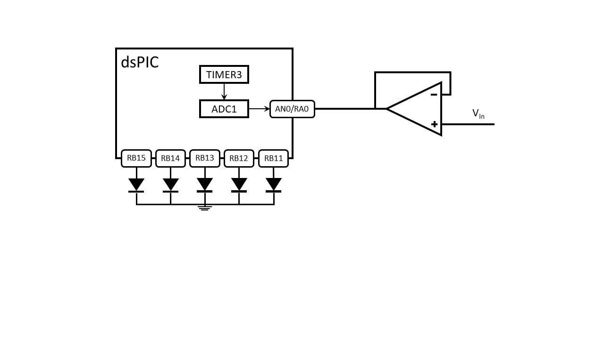

# Conversion analogique-numérique

## Introduction

Le convertisseur analogique-numérique (*ADC*) a pour rôle de transformer une tension analogique (évoluant de manière continue) en un nombre binaire codé sur un nombre de bits définis (10 ou 12 pour le dsPIC).

Le convertisseur réalise une double quantification :

* Quantification dans le temps : c’est l’échantillonnage
* Quantification en niveau

Le rendu d’un convertisseur numérique-analogique dépend donc de deux paramètres :

* La fréquence d’échantillonnage
* La résolution, c’est-à-dire le nombre de bits *N* codant la grandeur convertie, qui peut également être définie comme étant la plus petite variation de tension détectable : si le convertisseur a une plage de fonctionnement de 0V à 3,3V et convertit la grandeur sur 10 bits, on a :

  1 LSB = 3,3V/1024 = 4,22 mV  
  1 LSB (Least Significant Bit) est la plus petite variation de tension détectable par l'ADC.

## Réalisation d'un "voltmètre"

### Schéma

Pour vous familiariser avec l’utilisation du convertisseur analogique-numérique, nous allons réaliser un voltmètre :

Il mesure la tension à l’entrée **AN0** (**RA0**).

Un retour visuel se fait en utilisant un *bargraph* : 5 LED connectées à **RB15-RB11**.  
Le programme allume de 0 à 5 LED en fonction de la tension mesurée.

On utilise un suiveur de tension pour protéger l'entrée **AN0**.  Pour cela, on l'alimente entre 0 et 3,3V.  Si la tension appliquée dépasse cet intervalle, l'ampli saturera et la tension appliquée au dsPIC restera dans sa plage admissible.

### Code

l'*ADC* est un des périphériques les plus compliqués à configurer du dsPIC, car il a beaucoup de modes de fonctionnement.  
Nous avons écrit une librairie de fonctions permettant de l'utiliser.

La librairie supporte 2 modes de fonctionnement :

* Le mode "manuel", dans lequel c'est le code qui déclenche les conversions.
* Le mode "automatique" où c'est le débordement du *timer3* qui déclenche les conversions.  Dans ce cas, il faut également configurer le *timer3* pour déborder avec la période désirée.

Les projets voltmetre1.X et voltmetre2.X contiennent deux implémentations possibles, une pour chaque mode.

Le fonctionnement de l'*ADC* est décrit succintement dans la *datasheet* du dsPIC et plus en détail dans le manuel de référence de la famille dsPIC33F, qui se trouvent sur l'UV.