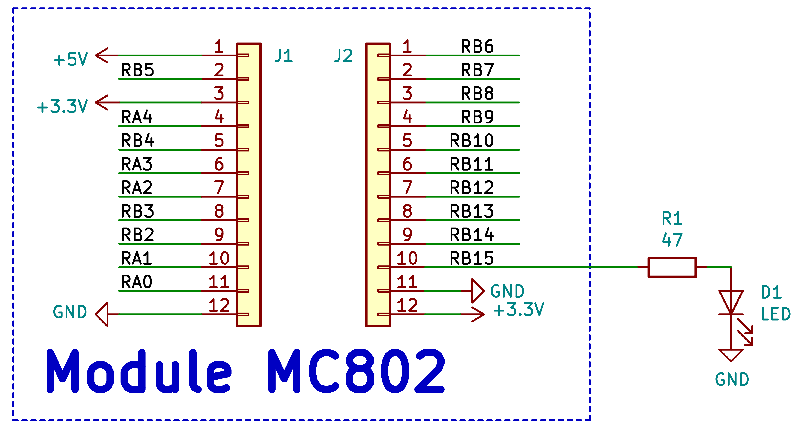

# pio1.X

## Schéma électronique

Nous utiliserons le [module dsPIC](../../Hardware/Le%20module%20MC802.md) du projet.  Il est représenté par la partie encadrée.



A ce module, nous ajoutons une LED (D1) qui sera contrôlée par la patte *RB15*.  Son courant est limité par *R1*.

La notice de la LED choisie (SLR-343PC) nous indique que son courant nominal est de 10 mA, pour une tension de 2,1V.

Si on suppose que la tension de sortie des PIO est 3,3v, on obtient :
$$
R1 = \frac{3,3V-2.1V}{10mA} = 120Ω
$$
En réalité, le courant sera plus faible, car l'impédance de sortie des PIO n'est pas négligeable.

## code

Le début du code définit les *configuration bits* du dsPIC.  
Cette partie du code a été générée automatiquement par *MPLAB X*, lors de la création du projet (décrite [ici](../../Guides/Création%20d'un%20nouveau%20projet.md)).  
En général, on démarre un nouveau projet en partant d'un exemple ou d'un projet précédent, on doit donc rarement toucher à cette partie du code.  Nous ne nous en préoccuperons pas pour l'instant.

La partie du code qui nous intéresse est :

```C
#define FCY 3685000    // Main clock frequency. Needed for __delay_ms
#include "libpic30.h"  // Contains __delay_ms definition
#include "xc.h"        // Contains SFR variables definition

int main(void) {
    // Initial setup and hardware configuration
    TRISBbits.TRISB15 = 0;  // Configure RB15 as a digital output pin

    // Main (infinite) loop
    while(1) {
        LATBbits.LATB15 = 1;    // turn the LED on
        __delay_ms(500);        // wait for 500ms
        LATBbits.LATB15 = 0;    // turn the LED off
        __delay_ms(500);
    }
    
    return 0;
}
```

## Structure générale

* La première ligne définit la valeur de la vitesse d'exécution (la fréquence des cycles-machines).  Cette valeur sera utilisée pour fixer la fréquence de clignotement de la LED.
* Les 2 lignes suivantes incluent des fichiers d'en-tête.  C'est l'équivalent du import de Python.
  * La librairie *libpic30* contient des fonctions spécifiques aux dsPIC.  Elle contient en particulier la fonction *__delay_ms* que nous utiliserons pour définir la durée des états de la LED.  C'est cette fonction qui a besoin de la définition de *FCY* pour pouvoir traduire un temps absolu (en ms) en un nombre de cycles-machines.
  * Le fichier *xc.h* contient la définition de toutes les variables associées aux *SFR* du dsPIC.  Il doit donc être inclus dans tous nos projets.
* Tous les programmes en C ont une fonction appelée *main* qui est appelée au début du programme. Elle est généralement divisée en 2 parties :
  * Elle commence par une phase d'initialisation dans laquelle on configure le mode de fonctionnement des périphériques (c'est l'équivalent du *setup* d'*Arduino*).  
  Dans notre cas, on y configure la patte *RB15* en sortie en modifiant le bit correspondant du registre **TRISB**.  On n'a pas à se préoccuper des périphériques qu'on n'utilise pas ; par défaut, ils sont désactivés.
  * Après la phase d'initialisation, on trouve une boucle infinie, généralement appelée boucle principale(équivalent de la fonction *loop* d'*Arduino*).  
  Ici, on utilise une boucle *while*.  
  Votre programme doit **toujours** se terminer par une boucle infinie, même si elle ne contient pas de ligne de code.  
  En effet, un processeur doit toujours avoir du code à exécuter.  Dans notre cas, si le dsPIC arrive à la fin de la fonction *main*, il ne sait plus quoi faire et il redémarre le programme.  
  Notre boucle principale est assez simple : elle met *RB15* à 1, attend 0,5s, met *RB15* à 0 et attend 0,5s.
  Ensuite, la boucle recommence.
* La dernière ligne de code est en fait inutile puisque le programme ne l'atteindra jamais.  C'est un héritage du langage C standard : la fonction main est définie comme étant de type *int*, elle doit donc avoir une instruction *return*.
