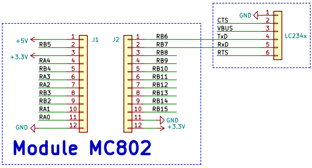
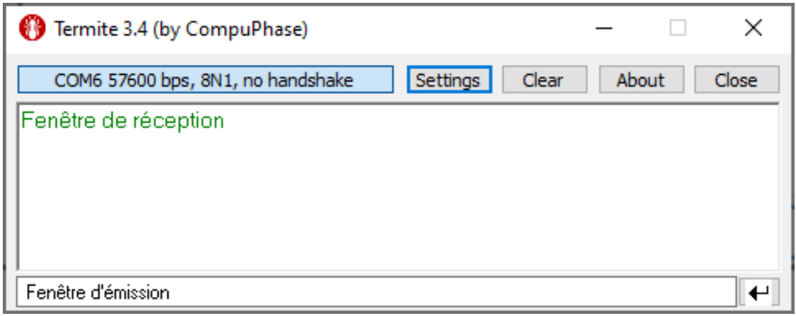
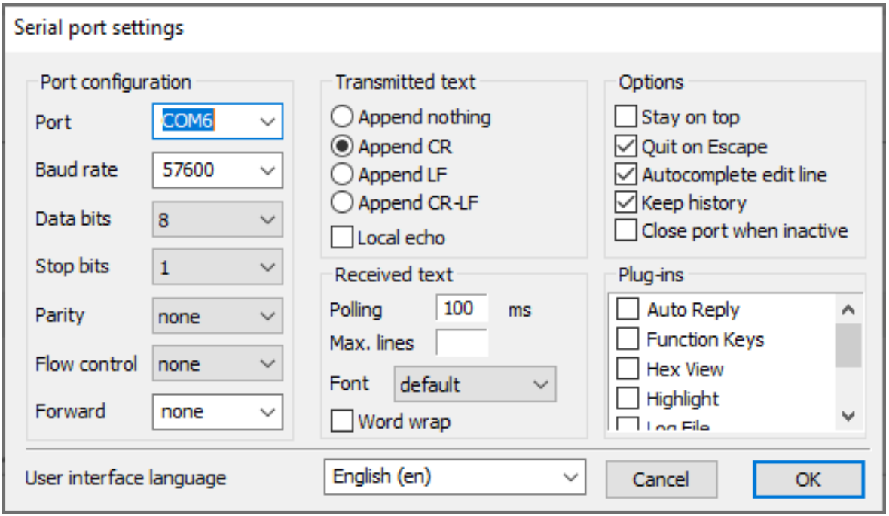
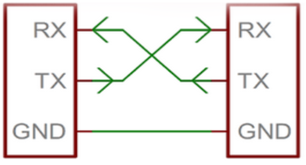
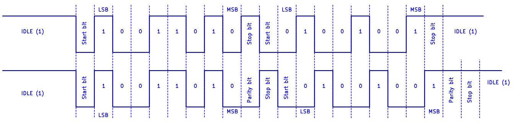
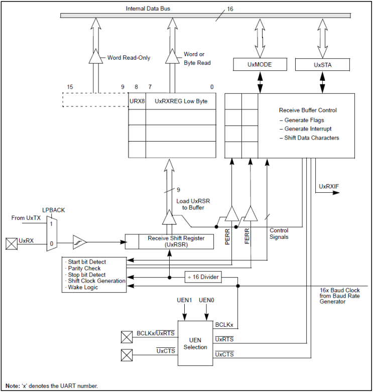

# Communication UART

L'exemple donné ici va vous permettre de vous familiariser avec 2 nouveaux concepts dont vous aurez besoin dans le projet et les exercices suivants :

* La communication série asynchrone (UART)
* Le Peripheral Pin Select qui est une fonctionnalité de notre dsPIC.

## l'écho

Dans cet exemple, nous allons connecter un dsPIC et un PC.  
Pour cela, nous utiliserons l'*UART* du dsPIC et un port USB du PC.

L'interface entre les deux sera réalisé par un module hardware dédié : le [LC234x](https://ftdichip.com/products/lc234x/).  
Ce module rend l'utilisation de l'USB transparente.  Le PC l'identifiera comme un port série virtuel (port *COM*), l'équivalent de l'UART pour les PC.

Comme application, nous utilisons un test classique du fonctionnement d'un canal de communication, l'écho : 

* Le PC émet une donnée sur son port COM
* le dsPIC reçoit la donnée et la renvoie au PC
* Le PC reçoit l'écho de la donnée qu'il a envoyée

La donnée parcoure donc le canal de communication dans les 2 sens.

## Schéma

Pour connecter le dsPIC à l'ordinateur, on utilise le module USB-UART *LC234x*.  
Il est alimenté par l'USB et ne doit donc pas l'être par notre montage (Par contre, sa patte VBUS fournit le 5V de l'USB qui peut être utilisé pour alimenter notre module).    
Il faut bien entendu connecter les masses des 2 modules ensemble.

Ses pattes **TxD** et **RxD** sont connectées à **RB6** et **RB7**.  Nous n'utiliserons pas les pattes **CTS** et **RTS**.

## dsPIC

Le code du projet (echo.X) est disponible sur le dépôt Github.

## Ordinateur

En général, il faut également écrire du code pour gérer la communication du côté de l'ordinateur.  
Toutefois, il existe des applications permettant d'utiliser facilement les ports série : les moniteurs série.  
Il en existe de nombreux.  Par exemple, [*Termite*](https://www.compuphase.com/software_termite.htm) est gratuit et simple d'utilisation.

Les moniteurs série interprètent les octets comme du texte.  
Les données reçues sont affichées dans a fenêtre de réception.  
Pour envoyer, il suffit de taper du texte dans la fenêtre d'émission.

Le bouton de *connexion/déconnexion affiche les paramètres utilisés : ici, le module USB-UART est connecté au port *COM6*, le baud rate est 57,6 kb/s, le format de trame est 8N1 et on n'utilise pas de protocole de *handshake* (gestion de flux).  
Ces paramètres sont expliqués ci-dessous.

On peut modifier ces paramètres avec *Settings* :

L'identifiant du port *COM* sera probablement différent pour vous.  
Vous pouvez tester les ports proposés dans le menu déroulant.  
Vous pouvez également trouver le port associé au module dans le *gestionnaire de périphérique* de *Windows*.

## UART

L'UART est le plus ancien protocole de communication utilisé pour faire communiquer 2 appareils.

Il est né dans les années 1960 et équipait tous les ordinateurs personnels jusqu'à la fin des années 1990 (sous le nom de RS-232), avant d'être remplacé par l'USB.  
Le standard RS-232 est encore fort utilisé dans le milieu industriel.  Il reste un bon choix pour les systèmes nécessitant la mise en œuvre d’une communication simple et rapide à mettre en œuvre et bon marché.

La version la plus simple d'une transmission RS-232 utilise trois fils (**Rx-Tx-GND**).  Les signaux de réception **Rx** et de transmission **Tx** sont croisés pour que le **Tx** d'un UART soit connecté au **Rx** de l’autre.  
Chaque UART peut simultanément émettre des données sur sa sortie **Tx** et en recevoir sur son entrée **Rx**.  
Ce type de transmission est appelée *Full Duplex*, car les deux interlocuteurs peuvent parler en même temps.

Le terme *asynchrone* signifie qu'il n'y a pas de synchronisation au niveau du bit. Cela évite d'avoir à transmettre un signal d'horloge en plus des signaux de données.  
Il y a toutefois une synchronisation au niveau de la trame, grâce au *start bit*.  Le récepteur synchronise son horloge interne sur le début du *start bit*.  Si la différence de fréquence entre les horloges de l'émetteur et du récepteur est suffisamment faible (<5%), le récepteur peut décoder la trame.
Pour cela, le *baud rate* (fréquence d'émission des bits) et le format de transmission (la composition du mot) doivent être connus à l'avance.  Il existe plusieurs formats possibles pour l'UART.

Le format d'une trame est défini par :

* L'état de repos (*IDLE*) du signal est 1
* La trame débute par le *start bit* qui vaut toujours 0.  Le récepteur peut donc détecter le début d'une trame en voyant un flanc descendant
* Le *start bit* est suivi des bits de donnée à transmettre, en commençant par le bit de poids faible (LSB).  Dans l'immense majorité des cas, il y a 8 bits de données
* Ensuite, vient l'éventuel *bit de parité*. Il existe 3 possibilités :
  * La plus simple : il n'y a pas de bit de parité dans la trame.  C'est notre cas
  * Le bit de parité ajouté assure une parité paire de la trame (even parity) : l'ensemble des bits de données et celui de parité contient un nombre pair de 1
  * Le bit de parité ajouté assure une parité impaire de la trame (odd parity) : l'ensemble des bits de données et celui de parité contient un nombre impair de 1
* La trame se termine par un *stop bit* qui assure que le signal est dans l'état par défaut à la fin de la trame.  La durée du stop bit est en général la même que les autres bits, mais il est prévu dans la norme qu'il puisse durer 1,5 ou 2 fois la durée définie par le *baud rate* (cela laisse plus de temps au récepteur pour traiter une trame avant le début de la suivante).  Le dsPIC supporte un stop bit de longueur 1 ou 2.

La parité permet la détection d'une erreur simple : si un seul bit a été altéré lors de la transmission, le récepteur s'en apercevra.  Il ne sera pas capable de déterminer quel bit est erroné.  Une erreur double est indétectable.

Les exemples ci-dessus montre la transmission des 2 mêmes octets, avec 2 formats différents :

* Le premier n'utilise pas de bit de parité et 1 seul stop bit. C'est celui que nous utiliserons. On l'appelle 8N1 (8 bits, No parity, 1 stop bit).
* Le second utilise une parité paire et 1 stop bit, soit 8E1 (8 bits, Even parity, 1 stop bit).

## UART du dsPIC

Notre dsPIC possède 2 périphériques UART.  Voyons comment les utiliser.

### Configuration de l'UART

L'UART a 3 registres de configuration :

* **UxMODE** : Registre configurant les modes de l’UART.
* **UxSTA** : Registre de contrôles et de statuts.
* **UxBRG** : Registre configurant le baud rate.

### Générateur de baud rate

La première étape est de définir le débit (baud rate) de l'UART.

L'UART a 2 modes de fonctionnement : le *mode standard* et le *mode high speed*.  
Ce dernier permet de travailler à des débits plus élevés, mais rend l'UART plus sensible au bruit.  Il est donc conseillé d'utiliser le mode standard lorsque c'est possible.  
Le mode de fonctionnement est défini par le bit **UxMODEbits.BRGH**.  
Le baud rate est défini par la valeur du registre **UxBRG**.

Pour **BRGH** = 0, **UxBRG** est donné par : **UxBRG** = ( **FCY** / (16 * *baud rate*) ) - 1

Lorsque **BRGH** = 1, **UxBRG** est donné par : **UxBRG** = ( **FCY** / (4 * *baud rate*) ) - 1

Où **FCY** est la fréquence du cycle-machine.

Dans le cas (fréquent) où le résultat n'est pas un nombre entier, arrondissez-le à l'entier le plus proche pour minimiser l'erreur.  A ce propos, sachez qu'en *C*, un nombre est TOUJOURS arrondi à l'entier inférieur lors des calculs.

### Procédure d’initialisation de l’UART

* Initialiser **UxBRG** pour le baud rate désiré (vérifier que l’arrondi ne crée pas une erreur de baud rate généré trop importante).
* Configurer le format des données (**UxMODE**).
* Activer l’UART (**UxMODE**).
* Activer la transmission (**UxSTA**).

Les deux derniers points doivent être impérativement réalisés dans cet ordre.

### Réception de caractères

Le schéma-bloc du récepteur est donné ci-dessous.  La donnée arrivant sur la patte **UxRX** du dsPIC est directement transférée dans le registre à décalage **UxRSR**.  
Ce dernier transforme le bus série en un bus parallèle.  La donnée est ensuite placée dans une mémoire tampon FIFO de longueur 4.

Le bit **UxSTAbits.URXDA** (UART Rx Data Available) est alors activé pour indiquer qu'une donnée est disponible.  Ce bit n'est accessible qu'en lecture.  Il est remis à 0 par l'UART lorsque la FIFO est vide.

Une lecture dans le registre **UxRXREG** permet de récupérer la plus ancienne donnée de la FIFO.

Lorsque la FIFO est remplie, une cinquième donnée peut encore être reçue dans **UxRSR**, avant qu’une erreur d’écrasement soit déclenchée.
Si la réception de la 5ème donnée se termine avant que la 1ère donnée de la FIFO ne soit lue :

* Elle n'est transférée dans la FIFO (et est donc perdue).
* **UxSTAbits.OERR** est activé pour indiquer une erreur d’écrasement.  
  Tant que ce bit n'est pas remis à 0 par le programme, l'UART ne reçoit plus de nouvelles données.  
  Toutefois, cette action entraine une réinitialisation de la FIFO, il faut donc au préalable lire les données de la FIFO si on ne veut pas les perdre.

Les erreurs de format et de parité sont également détectées automatiquement par l’UART et sont indiquées grâce respectivement à **UxSTAbits.FERR** et **UxSTAbits.PERR**.  
Comme indiqué sur le schéma-bloc, ces bits sont également enregistrés dans une file FIFO parallèle à celle des données reçues.  Les bits disponibles dans **UxSTA** fournissent donc le statut de réception de la donnée présente dans le registre **UxRXREG**.

### Emission d’un caractère

Pour envoyer une donnée, il suffit de l’écrire dans le registre **UxTXREG**.  
L'émetteur de l'UART a une structure similaire à celle du récepteur : **UxTXREG** est l'entrée d'une FIFO de longueur 4 qui alimente un registre à décalage.

**UxSTAbits.TXBF** (Tx Buffer Full) indique si la FIFO est pleine ou non.  Comme la transmission d'une trame prend beaucoup plus de temps que l'écriture dans un registre, il est toujours préférable de vérifier l’état de ce bit avant d’écrire une nouvelle donnée dans **UxTXREF**.

## Le peripheral pin select

L'**UART1** est connecté aux pattes **RP6** et **RP7** du dsPIC par le *Peripheral Pin Select* (PPS) du dsPIC.  
Le PPS permet de choisir à quelles pattes du dsPIC on veut connecter les périphériques utilisés, c'est très utile pour les µC qui possèdent peu de pattes.

### Connexion d'un périphérique à une patte d'I/O

Chaque I/O du dsPIC est connectée à la sortie d'un multiplexeur.  Tous les signaux de sortie des périphériques du dsPIC sont connectées aux entrées de ce multiplexeur.  Il peut donc connecter n'importe laquelle de ces sorties à la patte voulue.

De même, chaque signal d'entrée des périphériques est connecté à un multiplexeur dont les entrées sont connectées aux I/O, permettant de connecter n'importe quelle I/O à n'importe quelle entrée de périphérique.

Le fonctionnement détaillé du PPS est expliqué dans la datasheet du dsPIC à la section 11.6 et dans la section 30 du manuel de référence.  Leur lecture devrait vous permettre de comprendre les 2 lignes de code liées au PPS.
